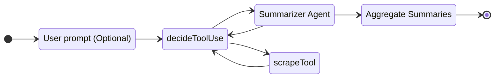

# TinyAgents - Sandboxed, Standalone Fragments

Prefix before I dive in. Unfortunately I cannot find the exact post, but I found some tangential names for what I will plan to describe. For anyone unfamiliar, the concept is similar to a Tweet. A signal rather than a full message. I have heard several developers write on their blogs using the concept of "artifacts" or "semaphores" and I have heard those who "curate digital gardens" call them seeds. While the names are different, the concept is the same. My last post used the term "artifact", but it is a small unit of work related to an overall system that communicates state or intent, rather than a full message.

Not only is this relevant for how I form posts, but it is also a term that has come up in the GenAI space.

> Artifacts allow you to turn ideas into shareable apps, tools, or content—build tools, visualizations, and experiences by simply describing what you need. Claude can share substantial, standalone content with you in a dedicated window separate from the main conversation. This makes it easy to work with significant pieces of content that you may want to modify, build upon, or reference later. &mdash; [Claude Support](https://support.claude.com/en/articles/9487310-what-are-artifacts-and-how-do-i-use-them) (Unironic emdash)

## Serverless Analogy

In the last couple of years, the enterprise world seemed hell-bent on micro-service this, micro-service that. In some cases, I think micro-services really shine. However, it is stupidly difficult to represent something stateful, as something state-less. LLM's are stateless. Maintaining a conversation involves reprocessing the entire conversation up to a new message. Token caches aside, they are this way because of the model's dependency on the content before to predict the content after. If the timeline of state is so short, a single inference runs and the next could come immediately after, or it could come weeks later, why hold onto state in memory?

I remember delving into serverless because I thought the idea was really great for Homelab applications. If you, hypothetically, were running a Raspberry Pi and had a fixed amount of memory, why would you want to run a container 24/7 if you only call it 3 times a day? Well, to be quite frank, because cold-starts suck and compute tends to be more expensive than sitting memory. Likewise, these systems of micro-vm's like [Firecracker](https://firecracker-microvm.github.io/) tend to be extremely complex and consume their own resources, have their own overhead. Likewise, if you own a piece of hardware, what does it save you if a VM sits there occupying call it 0.5% vCPUs?

Despite my love for the _concept_ of serverless, it does not have a large place in the Homelab world. Just because you can run say KNative, doesn't mean you _should_. But, by all means, run what you want in your homelab. I won't judge, although I may be jealous of your setup.

## Stateful or Stateless?

Live by the sword, die by the sword.

A lot of applications cannot be represented as stateless, nor in a lot of cases, should they be. Let's say you have a client Enterprise Resource Planning (ERP) system. Does it make sense to allocate, reserve, free compute every time a call is made? Probably not. Contrarily, a blog like this, where there is no comment section nor any backend code, that is perfect for serverless. Even if it was backed by serverless, the amount of resources to serve a couple static files would be near-nothing.

When I see these AI-wrappers, I think to myself, "man this is the ideal situation for serverless." You have a defined trigger (i.e. a message, a CRON job, a function call, etc.), and you have a roughly-structured unit of work. After that unit of work completes, some of that data _may_ persist. Depending on the use-case, the state will lie elsewhere.

We are nearing the end of the rant, but if you, the reader, cannot tell where I am going. Don't worry, we are on the cusp.

## Smalled Unit of Agent

Sidebar, SAP has an AI assistant called Joule which is named after the English physicist James Prescott Joule, who ironically came up with the definition of _single units of work_ which were named after him.

Let's say you are a nerd like me. Your morning/early afternoon consists of a check on [Hacker News](https://news.ycombinator.com/) or [Lobste.rs](https://lobste.rs/). Let's assume (for no reason whatsoever), that you want to automate this process (I don't, but bear with me). What would that look like from a code perspective? More than likely, it would involve hitting that endpoint (let's skip over JSON option for now), scraping the links for the top-today, visiting each link, and summarizing the contents. It would then take all of this information, combine it, and then provide a report.

This is low-hanging fruit to a LLM. Assuming you provide it a link, a process, and an expected output, this is relatively straight forward, for context, here is the defined process:


Now let's say you allow the agent to decide.



Let's make some assumptions:

- Your agent is 95% deterministic and 98% accurate in tool use (these are unreasonably high expectations).
- You provide the name of a site, rather than hard-coding the site.
- You have to visit a single site, and you want the top 10 articles.

Each unit of work would be:

- Decide to scrape
- Scrape (100% success)
- Summarize (100% success)

So if you visit 10 articles, your best-case scenario is 100%. That is an easy one. However the worst case scenario is slightly different. The two rates are mutually exclusive and describe multiple ways a tool can fail. One, because it misunderstood, and two because it "understood" but still chose the wrong route, or chose the right route once, but now chose a different.

$$
P(\text{Failure})=0.02+0.05=0.07
$$

$$
P(\text{Success}) = 1 - 0.07 = 0.93 \text{ or 93\%}
$$

$$
\text{Total success rate} = (0.93)^{10}
$$

$$
\text{Total success rate} \approx 0.48
$$

So in the worst case scenario, you are 48% accurate. Now, let's assume something different. Let's say that the LLM does not decide to use a tool explicitly, the number of articles is fixed, but a maximum, and the process _is_ deterministic. Your success rate, once the tool is written is 100% assuming each article is reachable.

## But How?

I referenced this article in another post, but I will include again: [Executable Code Actions Elicit Better LLM Agents](https://arxiv.org/abs/2402.01030). This is a great paper, but I want to take it one step further, and not from the research side, but from the practical implementation perspective. If we have a predefined process, and we are software engineers (or worst case scenario, we are testers). We can simply have the LLM agent attempt to write something, then build the automation around it. This concept, is artifacts. And while it seems very intuitive, I don't know why more companies have not started doing this. I know several of the vibe-coding apps allow you to host, however.

The idea here is simple and builds on the prior post of a small execution environment. Before we can build some of the other tooling, let's refactor the code. Instead of using it as a server, we will reformulate it as a tool.

```ts
import pyodideModule from "npm:pyodide/pyodide.js";

const pyodide = await pyodideModule.loadPyodide();

export async function runCode(
  code: string,
  enableLocalFS: boolean = false,
  modules?: string[],
) {
  await pyodide.loadPackage("micropip");
  const mpip = pyodide.pyimport("micropip");
  await mpip.install(modules || []);

  if (enableLocalFS) pyodide.mountNodeFS(".", "data_path");

  await pyodide.runPythonAsync(`
    import sys
    import io
    sys.stdout = io.StringIO()
  `);

  const returned = await pyodide
    .runPythonAsync(code)
    .then((out) => ({ out }))
    .catch((err) => ({ err: err.message }));
  const stdout = await pyodide.runPythonAsync("sys.stdout.getvalue()");

  return {
    stdout,
    returned,
  };
}
```

There is only one small change from the other post, it allows you to mount a local path if you chose to. I actually quite like this idea. It turns out, if you attempt to have the LLM go up in the file tree, it only will find pyodide directory, the one you mount, and the code directory. So at a minimum, it does have somewhat of a small sandbox.

For the sake of this post, I will assume you bring your own LLM that is OpenAI-endpoint compatible local, or not. I will be using `gpt-oss-20b`, although its Harmony Template sometimes has issues. Feel free to try out with any model. Assume, for the sake of this, your function has the signature of:

```ts
async function callLLM(messages: ChatCompletionMessageParam[]) {}
```

I highly recommend trimming any thinking tokens if your model returns them in the response to keep tokens, and also distractions low.

## Function Calls, Structured Output, YAML, so What?

In the example of code execution, and this is speculation, I'm not sure that outputting code as a function call seems very intuitive. It is neither intuitive for me as a developer, nor do I think this is a great design for the agent. LLM's typically surround their code in Markdown fenced code-blocks. These sometimes have a language specifier, sometimes the LLM drops this.

My callout would be: The LLM will often return multiple code-blocks. Examples:

- "To run, use `python3 ...`"
- "If you want to implement X functionality, use this code..."
- Here is an example of its usage: `call_func()`

The last is actually not a big issue, we would want that in the output. So, my brain leans towards the combination-fenced-code-blocks approach. This is super easy to implement using a regular expression:

````ts
function concatMarkdown(message: string) {
  const regex = /```(?:[a-zA-Z0-9]*)\n([\s\S]*?)```/g;

  let match: RegExpExecArray | null;
  let codeOutput = "";

  while ((match = regex.exec(message)) !== null) {
    codeOutput += `${match[1]}\n`;
  }

  return codeOutput.trim();
}
````

We will just iterate over all the fenced code blocks, grab each match inside, and aggregate with new-line characters in between. We will trim the edges because, why not? The last thing is, I would recommend using some small helper function to format messages just to keep your code less-verbose.

```ts
// I don't like { role: "assistant", content: responseToUser } everywhere.
function formatMessage(role: "system" | "assistant" | "user", content: string) {
  return { role, content };
}
```

## Agent Loop

The agent loop is super simple. Here are the steps as I have defiend them, but feel free to alter any way you want. We all have our opinions on styles.

- Invoke
- Write some code
- Execute the code
- Refine and continue or move on
- Respond to user

Super simple. A lot of posts I see on the internet do not share prompts. I will just because I am all about learning rather than gatekeeping.

System Prompt:

```
You are an expert programmer. You will be given a task, and your job is to complete it effectively
and correctly.

# Guidance

- Multi-step problems benefit from planning. To plan or think, use a multi-line string in Python wrapped in
a Markdown code block.
- Reminder: use Python code snippets to call tools! Assume you have any
dependencies referenced by the user already installed.
- Follow output and rules guidelines exactly.

# Rules
- Variables defined at the top level of previous code snippets can be referenced
in your code.
- Do not include information about installing or running. This will be handled
automatically.
- Avoid speculating the output. The code output will be provided to you afterwards.
- You must write code once. Do not respond directly with the answer.

# Output Format
- Python code snippet that provides the solution to the task, or a step towards the solution.
Any output you want to extract from the code should be printed to the console.
Code MUST be output in a fenced code block.
- Text to be shown directly to the user, if you want to ask for more information or
provide the final answer. Do NOT use fenced code blocks in this case.`;
```

Code Result Prompt:

```
Code output:
{{OUTPUT}}
User's prompt:
{{PROMPT}}

Reflect on the code written and the output. You must make a decision based on the code you wrote and the output.

If the output matches expectations, then respond with output without using fenced code blocks.
If the output is not ready, iterate until you have completed the task.
```

The test prompt will be what I referenced earlier, leveraging the file system and mounted directory. This is super simple, but just to give you an idea of that functionality first:

```
Find the hidden text file and tell me the message!
```

The file contains the content: "You found me!"

## Loop Time

```ts
async function runAgent() {
  let hasUsedTool = false;
  const MAX_TURNS = 5;
  const history: ChatCompletionMessageParam[] = [
    formatMessage("system", SYSTEM_PROMPT),
    formatMessage("user", TEST_PROMPT),
  ];

  const logCode = (label: string, code: string) => {
    if (console.groupCollapsed) {
      console.groupCollapsed(`🔧 ${label}`);
      console.log(code);
      console.groupEnd();
    } else {
      console.log(`--- ${label} ---\n${code}\n---\n`);
    }
  };

  for (let turnIdx = 0; turnIdx < MAX_TURNS; turnIdx++) {
    const out = await callLLM(history);
    const md = concatMarkdown(out.content!);

    if (md.length < 1 && hasUsedTool) {
      // LLM wants to output something to us.
      history.push(formatMessage("assistant", out.content!));
      break;
    } else if (md.length < 1 && !hasUsedTool) {
      // This will happen if the LLM does not output Python on the
      // first call properly.
      continue;
    }

    hasUsedTool = true;

    history.push(out);
    logCode("Wrote code", md);

    // LLM wants to execute code.

    const res = await runCode(md, true, []);

    const execOutput = STDOUT_OR_RETURN_PROMPT.replace(
      "{{OUTPUT}}",
      res.stdout || res.returned,
    );

    history.push(formatMessage("user", execOutput));
  }

  console.log(`Output:\n${history[history.length - 1]!.content}`);
}
```

Run results:

```
Wrote code
  import os

  # Search for hidden files in the current directory and its subdirectories
  hidden_files = []
  for root, dirs, files in os.walk('.'):
      for file in files:
          if file.startswith('.'):
              hidden_files.append(os.path.join(root, file))

  # Print the found hidden files
  print("Hidden files found:")
  for file in hidden_files:
      print(file)

  # Check if any hidden file contains a message
  for file_path in hidden_files:
      try:
          with open(file_path, 'r', encoding='utf-8') as file:
              content = file.read()
              if content.strip():
                  print(f"\nMessage found in {file_path}:")
                  print(content)
                  break
      except Exception as e:
          continue
Loading micropip
Loaded micropip
Output:
You found me!
```

## Introducing a Tad More Complexity

Let's modify the test prompt with something a bit more complicated.

```
Goal: Summarize the top 5 articles today from HackerNews.

Steps:
1. Pull the top HackerNews articles for today using their JSON API.
2. Get the HTML for each site using requests.
3. Markdownify each result
4. Calling 'await summarize(result)' for each result. Do not use a placeholder or implement. I will provide
this code.

Finally, write the concatenated results as a single Markdown file.
```

In order to allow the Python code to invoke a LLM, I added a module.

```ts
async function summarize(toSummarize: string) {
  const messages = [
    formatMessage("system", "You are an expert summarizer."),
    formatMessage(
      "user",
      `Summarize the following, only output the summary: ${toSummarize}`,
    ),
  ];

  const res = await callLLM(messages);
  return res.content;
}

pyodide.registerJsModule("llm", { summarize });
```

We can then include the import by default:

```ts
await pyodide.runPythonAsync(`from llm import summarize`);
```

The run looks good with GPT-OSS-20b, it hits it on its first shot. Qwen-3-30b-a3b had some issues where it was convinced it had to write the `summarize` function on its own each time.
Honestly the headlines of one of these articles is nutty. "Running Doom on Pinebuds Pro Earbuds" is a wild title. Reminds me of "Running Doom on 100 pounds of mold potatoes"


<details>
<summary>View LLM Generated Python</summary>

```py
import asyncio
import datetime
from typing import List

import requests
from markdownify import MarkdownConverter


def html_to_md(html: str) -> str:
    return MarkdownConverter().convert(html)


async def main() -> None:
    top_stories_url = "https://hacker-news.firebaseio.com/v0/topstories.json"
    try:
        ids_resp = requests.get(top_stories_url, timeout=10)
        ids_resp.raise_for_status()
        top_ids: List[int] = ids_resp.json()
    except Exception as e:
        print(f"Failed to fetch top stories IDs: {e}")
        return

    today_utc = datetime.datetime.utcnow().date()
    summaries: List[str] = []
    user_agent = "Mozilla/5.0 (compatible; HNSummarizer/1.0)"
    headers = {"User-Agent": user_agent}

    for story_id in top_ids:
        if len(summaries) >= 5:
            break

        item_url = f"https://hacker-news.firebaseio.com/v0/item/{story_id}.json"
        try:
            item_resp = requests.get(item_url, timeout=10)
            item_resp.raise_for_status()
            item_data = item_resp.json()
        except Exception as e:
            print(f"Failed to fetch story {story_id}: {e}")
            continue

        if not item_data.get("url") or "time" not in item_data:
            continue

        story_time = datetime.datetime.utcfromtimestamp(item_data["time"]).date()
        if story_time != today_utc:
            continue

        url = item_data["url"]
        title = item_data.get("title", "Untitled")

        try:
            page_resp = requests.get(url, headers=headers, timeout=10)
            page_resp.raise_for_status()
            html_content = page_resp.text
        except Exception as e:
            print(f"Failed to fetch URL {url}: {e}")
            continue

        md_content = html_to_md(html_content)

        summary_text = await summarize(md_content)  # type: ignore
        if not isinstance(summary_text, str):
            try:
                import json

                summary_text = json.dumps(summary_text)
            except Exception:
                summary_text = str(summary_text)

        summaries.append(f"### {title}\n\n{summary_text}")

    if not summaries:
        print("No HackerNews stories found for today.")
        return

    final_markdown = "\n\n---\n\n".join(summaries)
    output_file = "hn_top5.md"
    try:
        with open(output_file, "w", encoding="utf-8") as f:
            f.write(final_markdown)
        print(f"Summaries written to {output_file}")
    except Exception as e:
        print(f"Failed to write output file: {e}")


if __name__ == "__main__":
    asyncio.run(main())
```

</details>

<details>
<summary>Expand to see rendered Markdown</summary>
<div style="margin: 2rem">
<h3 id="a-macos-app-that-blurs-your-screen-when-you-slouch">A macOS app that blurs your screen when you slouch</h3>
<p>Posturr is a lightweight macOS utility that monitors your posture in real‑time using the Mac’s camera and Apple’s Vision framework. When it detects you slouching, it progressively blurs all open windows to nudge you back into good form. The app runs as a background menu‑bar icon, offers adjustable sensitivity, calibration, and multi‑display support, and keeps all video processing local with no cloud tracking. It can be installed from the released zip or built from source on macOS 13+.</p>
<hr>
<h3 id="using-postgresql-as-a-dead-letter-queue-for-event-driven-systems">Using PostgreSQL as a Dead Letter Queue for Event-Driven Systems</h3>
<p>The article describes how a Wayfair project used CloudSQL PostgreSQL as a Dead Letter Queue (DLQ) for an event‑driven pipeline that ingests Kafka events, hydrates them via downstream APIs, and stores enriched data in PostgreSQL. When processing failures occurred—API outages, consumer crashes, malformed payloads—the team redirected failed events to a dedicated <code>dlq_events</code> table instead of dropping or requeueing them in Kafka. The table stored raw JSONB payloads, error details, status (<code>PENDING</code>/<code>SUCCEEDED</code>), retry count and delay timestamps, with indexes on status, retry time, event type, and creation date to support efficient querying and retries.</p>
<p>A retry scheduler, protected by ShedLock to run only once across multiple instances, periodically selects eligible <code>PENDING</code> rows using a <code>SELECT … FOR UPDATE SKIP LOCKED</code> query. It processes up to 50 events every six hours, increments retry counters, updates status on success, and respects a maximum retry limit of 240 attempts. This approach keeps failures visible for debugging via simple SQL queries, avoids retry storms, and allows automatic reprocessing when downstream services recover.</p>
<p>Overall, the solution leverages Kafka’s strengths in high‑throughput ingestion while using PostgreSQL’s durability and queryability to handle failures predictably, reducing operational stress and making failure handling a routine, observable part of the system.</p>
<hr>
<h3 id="doom-has-been-ported-to-an-earbud">Doom has been ported to an earbud</h3>
<p><strong>DOOMBUDS – Running Doom on Pinebuds Pro Earbuds</strong></p>
<ul>
<li><p><strong>What it is</strong>: A remote‑play version of the classic 1993 game <em>DOOM</em> that runs entirely inside the firmware of Pinebuds Pro earbuds (the only earbuds with open‑source firmware). Players queue online and play via a browser interface, with gameplay streamed back as low‑latency MJPEG over Twitch once enough users are in the queue.</p>
</li>
<li><p><strong>Architecture</strong>  </p>
<ol>
<li><strong>Doom port</strong> compiled for the earbuds’ Cortex‑M4F CPU.  </li>
<li><strong>Serial server</strong> bridges the UART connection to a web server and transcodes the video stream to Twitch.  </li>
<li><strong>Web server</strong> serves assets, manages the player queue, forwards key presses, and delivers the MJPEG feed.  </li>
<li><strong>Static front‑end</strong> (HTML/JS) that displays the game screen, handles controls, and shows the queue status.</li>
</ol>
</li>
<li><p><strong>Key technical challenges &amp; solutions</strong><br><em>Serial bandwidth</em>: UART gives ~2.4 Mbps → raw framebuffer (~96 kB per frame) would only allow ~3 fps.<br><em>Compression</em>: Use JPEG encoding (via an embedded encoder) to send each frame as a JPEG; average size ~11–13.5 kB, yielding theoretical 22‑27 fps.<br><em>CPU</em>: Stock firmware runs at 100 MHz; boosted to 300 MHz. The Cortex‑M4F can run DOOM but is limited by JPEG encoding (~18 fps).<br><em>RAM</em>: Base RAM 768 KB → ~992 KB after disabling the coprocessor. Extensive optimizations (pre‑computed tables, const‑variables in flash, no caching) reduce Doom’s memory footprint from 4 MB to fit within the limit.<br><em>Flash storage</em>: The full DOOM shareware WAD is 4.2 MB but the earbuds have only 4 MB of flash. Using Fragglet’s “Squashware” trimmed‑down 1.7 MB WAD makes it possible.</p>
</li>
<li><p><strong>Usage</strong>: Anyone can clone the repos –<br><em><a href="https://github.com/arin-s/DOOMBuds">DOOMBuds</a></em> (firmware) and <em><a href="https://github.com/arin-s/DOOMBUDS-JS">DOOMBUDS-JS</a></em> (web client).<br>The project also provides a queue interface, key‑binding instructions, and Twitch‑based streaming for bandwidth savings.</p>
</li>
<li><p><strong>Extras</strong>: A forthcoming article/video will dive deeper into the implementation details. Links to the developer’s LinkedIn are included for hiring interest.</p>
</li>
</ul>
<hr>
<h3 id="faa-institutes-nationwide-drone-no-fly-zones-around-ice-operations">FAA institutes nationwide drone no-fly zones around ICE operations</h3>
<p>The FAA has issued NOTAM FDC 6/4375, creating a nationwide moving drone‑no‑fly zone around all Immigration &amp; Customs Enforcement (ICE) and other Department of Homeland Security (DHS) mobile assets—including vehicle convoys and escorts. Drones are prohibited within 3,000 ft laterally and 1,000 ft vertically of these facilities or vehicles at all times; the restriction moves with the assets and is not tied to fixed coordinates or time windows. The zone is classified as “national defense airspace” under federal security statutes, and violators may face criminal prosecution, civil penalties, administrative action, or revocation of FAA privileges; drones deemed a credible threat can be seized or destroyed. Limited exceptions exist for operations directly supporting national defense, homeland security, law‑enforcement, firefighting, search‑and‑rescue, or disaster response missions that receive prior coordination with DHS or the FAA. The move has drawn criticism from drone operators and civil‑liberties groups who note the lack of real‑time visibility into where ICE convoys operate, raising concerns about inadvertent violations.</p>
</div>
</details>

## Continuation

So how does this line up with the original article introduction? The idea that I have, is that any LLM generated process (in this example a block of code, several dependencies, and a mounted folder that produces a file) exists as an artifact. And, instead of making your agent grapple for tools, reasoning chains, complex planning and execution, have it just write some Python. That Python output can then be re-used, scheduled, deployed (with great caution), or just discarded to be written again.

If you made it this far, thanks for reading. Don't let big-AI companies sell you on agents like it's some black-magic you could never produce yourself with cheaper models, more confined infrastructure, less time, etc. There is a massive knowledge gap between "we are AI-native" and "I get agents, but if I had to code one, I would have very little idea of how to get effective output from them."

Cheers.