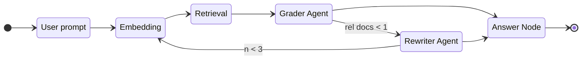

# [Code] Less Sloppy Slop - Tinier Abstractions for LLMs

My "Initial Commit" post did not age well. Regardless, in an attempt to revitalize my blog, I would like to discuss something I have been working on lately. That is, reducing slop in a slop world.

Everyone and their grandmother is building GenAI applications it feels like. And, while I recognize the magnitude of the hype does not match the magnitude of the value, I still enjoy poking around with cool-shiny-things especially as an avid `/r/localllama` peruser.

So, keep that in mind that any workflow, graph, or even basic application I work with in my personal time **will not** inherit the capabilities of SOTA models that can get away with far longer, more detailed, or even more vague instructions. It needs to be distilled, simple from a prompt perspective, and fail fast.

## What do we really need?

If I were to ask someone at random to recommend a framework for building GenAI applications, I would likely hear LangChain, LangGraph, maybe PydanticAI if someone feels rather creative, but I would hazard a guess no, "OpenAI package is all you need" would be said. Doing so might send shivers down an AI-wrapper-start up founder's spine.

Humor aside, at the bare minimum we need a few things:

- Some "pipeline" composed of steps.
- A meaningful way of maintaining state across the pipeline.
- A code-driven approach for transitioning between nodes.

The philosophical framework aligns with KISS (keep-it-simple-stupid). In general, building with AI becomes easier if you assume the model has a default flag for `stupid: true`. This becomes exponentially more apparent as parameter size decreases.

Before diving into a pseudo-code implementation of the basics, I think it is worth mentioning, this approach is not specific to AI. In fact, graphs like this are useful for data-processing, in-game world simulations, and more. A state graph is nothing more than a fancy mental model for a set of functions, function calls, variables, and conditionals. I do, however, prefer this tiny amount of abstraction as it compartmentalizes each node, and it's I/O, from the entire application reducing the cognitive load and increasing the productivity and reusability.

## Common Pattern

Let's start with what I would consider a typical RAG workflow.



The idea here is that we have to answer a user's question based off a set of embedded documents. While a large model would likely get less-thrown off by irrelevant documents returned, smaller models tend to get side-tracked far more easily.

So, we add a "Grader Agent" or, essentially, an LLM call with structured output that determines relevance in accordance to what the user asked.

Likewise, there is a non-zero chance the LLM decides to rain on our parade, or that the results are sub-par, we could call a "Rewriter Agent" to reformulate the query grounded on the sources we found and the structure/content of the documents, or to broaden the search.

## Pseudocode for Graph

This might seem rudimentary, but bear with me. My high school professor was obsessed with finite-state-machines and game development which shaped my early learning, but I realize a lot of programmers aren't as familiar with this concept. For example, in university, we spent more time on [AVL Trees](https://www.geeksforgeeks.org/dsa/self-balancing-binary-search-trees/) and Discrete mathematics than we did basic graphs. The former two are often less useful in the enterprise software world than the latter.

Sidebar: My high school professor was awesome. Getting exposed to the rabbit hole of cellular automaton, game theory, and more at a younger age was deeply impactful on how I view the world.

```text
BEGIN NODE
    SIGNATURE: Execute(CURRENT_STATE, AVAILABLE_TRANSITIONS = None) -> (
        PATCH, NEXT_NODE
    )

    [PLACEHOLDER LOGIC]  # Each node will implement this

    RETURN: PATCH        # a state diff to be applied with apply_patch()
    RETURN: NEXT_NODE    # node identifier or None
END NODE
```

```text
BEGIN GRAPH
    SIGNATURE: Run(INITIAL_STATE) -> (CURRENT_STATE)

    VAR: NEXT_NODE = START_NODE
    VAR: CURRENT_STATE = INITIAL_STATE

    WHILE NEXT_NODE != None
        VAR: PATCH, NEXT_NODE = NEXT_NODE.Execute(
            CURRENT_STATE, AVAILABLE_TRANSITIONS = None
        )

        CURRENT_STATE = apply_patch(CURRENT_STATE, PATCH)
    ENDWHILE

    RETURN: CURRENT_STATE
END GRAPH
```

This is really all you need for a directed graph. I like to think of this as a `O(n)` complexity of implementation (excluding types) just because it is that straight forward. Thank `brython` for existing so you can run it as-is in the browser.

## Python Implementation

```py
from typing import Callable, Dict, Optional, Tuple, Any


def apply_patch(
    state: Dict[str, Any], patch: Optional[Dict[str, Any]]
) -> Dict[str, Any]:
    """
    Return a new state with the shallow patch applied (None => no-op).
    """
    new = dict(state)
    if patch:
        new.update(patch)
    return new

class Node:
    """
    Minimal node abstraction. Provide a handler callable with signature:
      handler(current_state: dict, available_transitions: Optional[dict]) ->
        (patch: dict|None, next_node_id: Optional[str])
    """

    def __init__(self, node_id: str, handler: Optional[Callable] = None):
        self.id = node_id
        if handler is None:
            # default handler does nothing and terminates graph
            handler = lambda state, avail: (None, None)
        self._handler = handler

    def execute(
        self,
        current_state: Dict[str, Any],
        available_transitions: Optional[Dict] = None,
    ) -> Tuple[Optional[Dict[str, Any]], Optional[str]]:
        return self._handler(current_state, available_transitions)


class Graph:
    """
    Graph runs nodes by id. nodes: mapping of id -> Node. start: start node id.
    """

    def __init__(self, nodes: Dict[str, Node], start: str):
        if start not in nodes:
            raise KeyError("start node not in nodes")
        self.nodes = nodes
        self.start = start

    def run(self, initial_state: Dict[str, Any]) -> Dict[str, Any]:
        current_state = dict(initial_state)
        next_node = self.start

        while next_node is not None:
            node = self.nodes[next_node]
            patch, next_node = node.execute(current_state, available_transitions=None)
            current_state = apply_patch(current_state, patch)
        return current_state


def example_usage():
    def start_handler(state, _):
        return ({"count": 0}, "inc")

    def inc_handler(state, _):
        n = state.get("count", 0) + 1
        if n >= 3:
            return ({"count": n}, None)
        return ({"count": n}, "inc")

    nodes = {
        "start": Node("start", start_handler),
        "inc": Node("inc", inc_handler),
    }

    g = Graph(nodes, start="start")
    final = g.run({})

    return final

```

<script src="https://cdnjs.cloudflare.com/ajax/libs/brython/3.13.2/brython.min.js" integrity="sha512-IKveykv1kbclOAQgkHa8FlDamEXz4VXLCfQFjaWSou9/+pRVt1vvhnwJYUYgMDkm2OFSRpQBWZKf3C9YpNDM9g==" crossorigin="anonymous" referrerpolicy="no-referrer"></script>
<script src="https://cdnjs.cloudflare.com/ajax/libs/brython/3.13.2/brython_stdlib.min.js" integrity="sha512-qvkLif4T+bZt+cx/RX2cub67tAx3lalol0A0An2tKD7YkXVBFBr+QGMhUrEmBRwJtg4QSsVEWMxF8zmA4woB5Q==" crossorigin="anonymous" referrerpolicy="no-referrer"></script>

<script type="text/python">
from time import time
from browser import bind, document, alert
from typing import Callable, Dict, Optional, Tuple, Any


def apply_patch(
    state: Dict[str, Any], patch: Optional[Dict[str, Any]]
) -> Dict[str, Any]:
    """
    Return a new state with the shallow patch applied (None => no-op).
    """
    new = dict(state)
    if patch:
        new.update(patch)
    return new


class Node:
    """
    Minimal node abstraction. Provide a handler callable with signature:
      handler(current_state: dict, available_transitions: Optional[dict]) ->
        (patch: dict|None, next_node_id: Optional[str])
    """

    def __init__(self, node_id: str, handler: Optional[Callable] = None):
        self.id = node_id
        if handler is None:
            # default handler does nothing and terminates graph
            handler = lambda state, avail: (None, None)
        self._handler = handler

    def execute(
        self,
        current_state: Dict[str, Any],
        available_transitions: Optional[Dict] = None,
    ) -> Tuple[Optional[Dict[str, Any]], Optional[str]]:
        return self._handler(current_state, available_transitions)


class Graph:
    """
    Graph runs nodes by id. nodes: mapping of id -> Node. start: start node id.
    """

    def __init__(self, nodes: Dict[str, Node], start: str):
        if start not in nodes:
            raise KeyError("start node not in nodes")
        self.nodes = nodes
        self.start = start

    def run(self, initial_state: Dict[str, Any]) -> Dict[str, Any]:
        current_state = dict(initial_state)
        next_node = self.start

        while next_node is not None:
            node = self.nodes[next_node]
            patch, next_node = node.execute(current_state, available_transitions=None)
            current_state = apply_patch(current_state, patch)
        return current_state


def example_usage():
    def start_handler(state, _):
        return ({"count": 0}, "inc")

    def inc_handler(state, _):
        n = state.get("count", 0) + 1
        if n >= 3:
            return ({"count": n}, None)
        return ({"count": n}, "inc")

    nodes = {
        "start": Node("start", start_handler),
        "inc": Node("inc", inc_handler),
    }

    g = Graph(nodes, start="start")
    final = g.run({})

    return final

@bind(document['py-run'], 'click')
def handle_click(event):
    output_container = document["output"]
    start = time()
    final = example_usage()
    end = time()
    output_container.innerHTML = ""
    output_container <= "Output: " + str(final) + "\n"
    diff = (end - start)
    output_container <= f"Took {diff:.3f}ms. Only so you know it really ran =)"
</script>

Run with Brython
<button id="py-run">Execute Python Inline</button>
<pre id="output"></pre>


## Room for Improvement

All the above is what I would define as the building blocks for more complex applications. However, I acknowledge, the use-case influences the framework. So, in my pursuit of not reinventing the wheel with each POC, I built [tinygraph-ts](https://github.com/HarryLovesCode/tinygraph-ts/tree/main). Like Pocketflow, it can also be ported in a single-shot to any language. However, it does not prioritize LoC, dependencies, and operator overloads. It just seeks to be simple and to encourage good patterns. 

---

⚠️ Note: This is *just* my rationale and not the critique of any developer. It is my thought process on why this library is not for *me*.

I really wanted to like [Pocketflow](https://github.com/The-Pocket/PocketFlow), but what I thought was a superpower of being small, was a library that attempts to be minimal, if only for the sake of it. The project cites, "separation of concerns" as the rational for the structure of a node:

- prep
- exec
- post

1. However, if the majority of your prep is pulling from shared state, why does this need to be a separate function? 
2. If the complexity of your node is already low, or the complexity is hidden by an external function call by a more robust implementation, why separate `exec` and `post`?
3. I will skip over operator overload in Python, that is largely preferential.
4. Finally, why have a separate `async` implementation if you could handle `async` versus `sync` using `inspect.iscoroutinefunction(object)`? You could even use `concurrent.futures` to offload them to a `ThreadPoolExecutor` and have fine-grained concurrency controls.

That said, I love the philosophy of the project. Keep all the dependencies of the graph *outside* the graph. You are not tied to any library and which dependencies it wraps. This is such a beautiful concept. If I want to POC using a specific VectorDB locally, but use a different one in production, I don't have to shop around or even think in two places before I have started the project. If one works locally but doesn't work down the line, I can build a tiny adapter.

Libraries should enable, not hinder and for all I critique about Pocketflow, simplicity in 2026 is a welcome change and other libraries should take note.

Fork it, skip it, use it. Whatever you do with or without this library, enjoy being a developer and take time to smell the roses. Cheers.

## Example of TinyGraph

```ts
import { Graph, type Node, type Ctx } from "tinygraph-ts";

// fetch.ts
class FetchNode implements Node<State> {
  async next(state: Ctx<State>) {
    console.log("Made to fetch!");
    const r = await fetch(state.site as string).then((response) =>
      response.json()
    );

    return {
      context: { json: r },
      transition: "log",
    };
  }
}
// log.ts
class LogNode implements Node<State> {
  async next(state: Ctx<State>) {
    console.log(`User ID: ${state.json?.userId}`);
    // Note: No transition returned, ends the graph here.
  }
}
// index.ts
// Define type-safe graph. `site` is required to run so it is guranteed to exist,
// but the result is *not* if an error occurs or `FetchNode` has not been run.
type State = {
  json?: {
    userId: number;
    id: number;
    title: string;
    completed: boolean;
  };
  site: string;
};

const graphRes = new Graph<State>()
  .node("fetch", new FetchNode())
  .node("log", new LogNode())
  .edge("fetch", "log")
  .setStart("fetch")
  .run({ site: "https://jsonplaceholder.typicode.com/todos/1" });

console.log(await graphRes);
```
